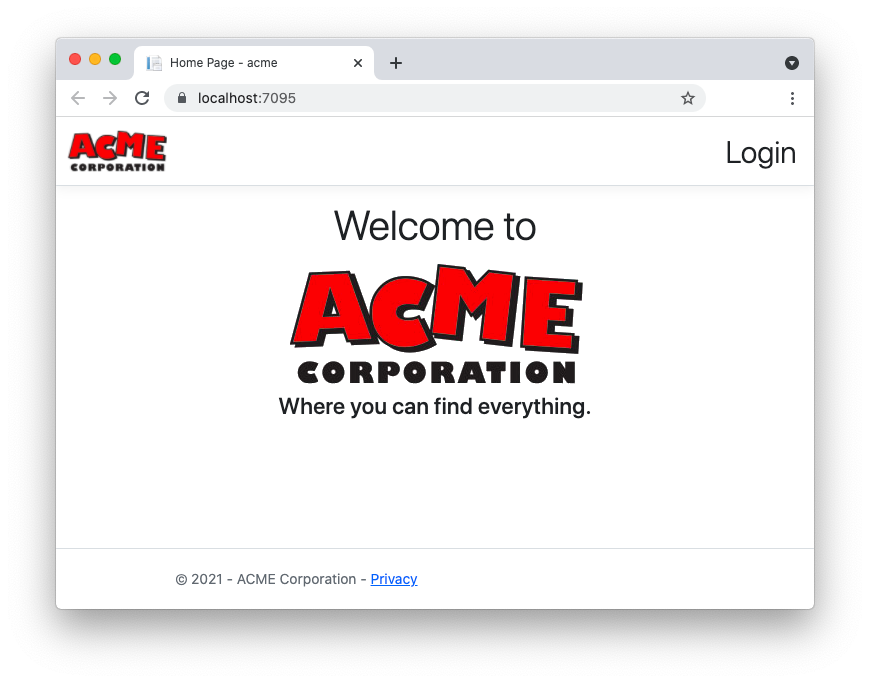

This repository contains a basic ASP.NET Core MVC application integrated with Auth0 authentication.

Check out the article [Add Authentication to Your ASP.NET Core MVC Application](https://auth0.com/blog/add-authentication-aspnet-core-mvc/) for the implementation details.

# Requirements

- [.NET 6 SDK](https://dotnet.microsoft.com/download/dotnet/6.0) installed on your machine
- Visual Studio 2022 (optional)

# To run this application

1. Clone the repo with the following command:

   ```bash
   git clone https://github.com/auth0-blog/acme-aspnet-mvc.git
   ```

2. Move to the `acme-aspnet-mvc` folder.

3. Add your Auth0 domain and client id to the `appsettings.json` configuration file (see [Register with Auth0](https://auth0.com/blog/add-authentication-aspnet-core-mvc/#Register-with-Auth0) for more details).

4. Type `dotnet run` in a terminal window to launch the application.

5. Point your browser to the [https://localhost:7095](https://localhost:7095) address. You should see a web page like the following:


